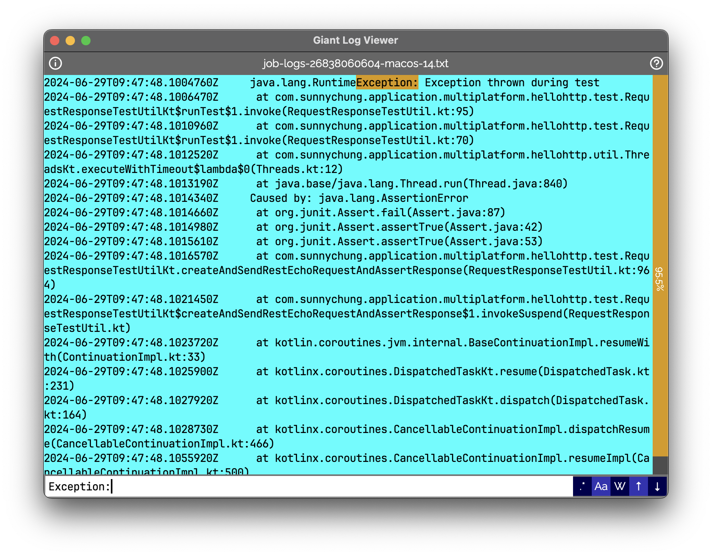

# Giant Log Viewer

Needing to check a 4.9 GB log file on a platform where the `less` file pager is not available? Don't cry. This software is going to save you!

This software loads instantly with same low memory footprint regardless of a 4 MB, 4 GB or 4 TB text file is opened, as long as it doesn't hit any [limitation](#limitations). The JVM is limited to use at most 80 MB heap memory (plus overheads) currently.

## Limitations
- Supports UTF-8 encoding and ASCII text files only
- Doesn't work if there is a long line (>= 1 MB) in the file
- Emoji sequences are not supported -- it would be displayed as multiple emoji characters
- Doesn't work if your OS has no GUI
- Doesn't work if you are not using Windows, macOS nor Linux
- Not as powerful as `less` yet

## How to Use

1. Drag and drop a UTF-8 / ASCII text file to this application.
2. Navigate with a keyboard. The `less` key bindings can be used. Click the "?" button in the top-right corner for the full keymap.

## Executables are not signed by verified developers

Builds are built by GitHub runners which take the source code published here directly. You can always examine the source code or build yourself. Please also consider donation so that I could sign the executables one day.

## Bug Reporting

[https://github.com/sunny-chung/giant-log-viewer/issues](https://github.com/sunny-chung/giant-log-viewer/issues)

## Contributions

Welcome! Note that this project is [slightly reluctant to use third-party libraries](build.gradle.kts).
